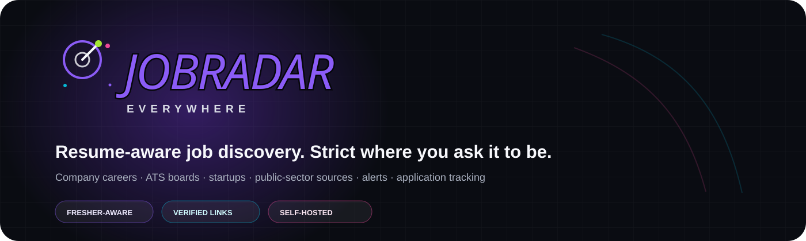
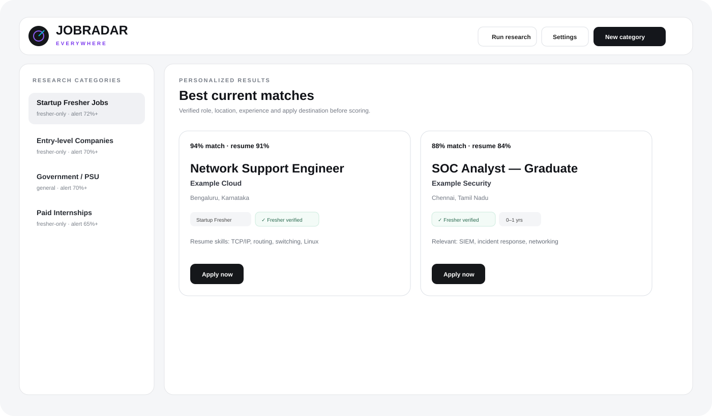
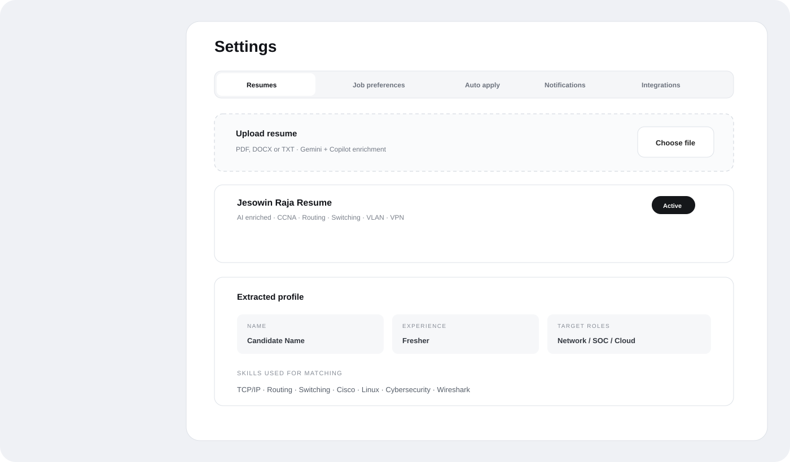
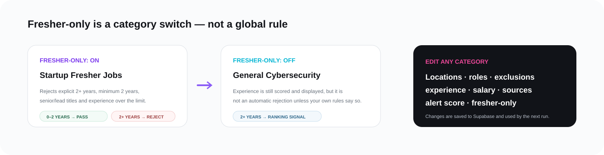
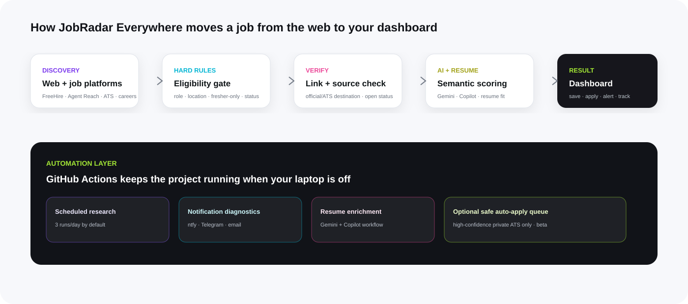

<p align="center">
  
</p>

# JobRadar Everywhere

**JobRadar Everywhere** is a self-hosted, resume-aware job research dashboard that searches multiple job ecosystems, verifies listings, filters them with category rules, scores them against your active resume, tracks applications, and sends alerts through **ntfy, Telegram, and email**.

It is designed to keep running in the cloud with **GitHub Actions + Supabase + Vercel**, so your laptop does not need to stay on.

<p align="center">
  
  &nbsp;&nbsp;
  
  &nbsp;&nbsp;
  
  &nbsp;&nbsp;
  
  &nbsp;&nbsp;
  
  &nbsp;&nbsp;
  
</p>

---

## Preview

### Main dashboard

<p align="center">
  
</p>

### Resume and settings workspace

<p align="center">
  
</p>

> The preview files use synthetic example data. They do not contain a real user's email, resume, job applications, or credentials.

---

# What does it do? — non-technical explanation

If you do not care about the code, think of JobRadar Everywhere as six workers running together:

1. **The Scout** searches company career pages, ATS boards, startup sources, public-sector pages, and broader job-platform discovery results.
2. **The Bouncer** checks your category rules. A category marked **Fresher-only** can reject a listing such as `2+ years of hands-on experience` before it ever receives a high score.
3. **The Verifier** checks whether the listing is still reachable and whether an official/direct application destination can be identified.
4. **The Resume Matcher** compares the job against the resume you selected in Settings.
5. **The Messenger** sends qualifying jobs to ntfy, Telegram, and email.
6. **The Tracker** keeps saved jobs, application states, and optional high-confidence auto-apply queue entries.

The important idea is that **fresher filtering belongs to the category**. It is not a global rule that incorrectly blocks experienced roles in a general category.

## Who is this useful for?

JobRadar Everywhere is especially useful for:

- fresh graduates searching networking, cybersecurity, NOC/SOC, infrastructure, cloud-support, and closely related roles;
- candidates who want resume-aware matching instead of job-title-only filtering;
- users tracking government/PSU, startup, company, and internship opportunities together;
- job seekers who want one place to save jobs, track applications, and receive verified alerts;
- self-hosters who want a free-first job research workflow that continues running in GitHub Actions while their computer is off.

The default categories are still oriented toward fresher networking/cyber/cloud work, but the category editor lets another user repurpose the project for broader or non-fresher searches.

<p align="center">
  
</p>

---

# How the system works

<p align="center">
  
</p>

The default research flow is:

```text
GitHub Actions schedule / Run research
        │
        ├── Load active resume + saved preferences
        ├── Load dashboard-managed integrations
        ├── Search direct government/public sources
        ├── Search FreeHire
        ├── Search Agent Reach / Exa discovery
        │      ├── LinkedIn discovery
        │      ├── Indeed discovery
        │      ├── Naukri discovery
        │      ├── Wellfound / Cutshort / Instahyre discovery
        │      └── Greenhouse / Lever / Ashby / SmartRecruiters discovery
        │
        ├── Category semantic gate
        ├── Category-specific fresher gate
        ├── Location / role checks
        ├── URL + application-link verification
        ├── Gemini / Copilot semantic review when enabled
        ├── Resume match + skill-gap score
        ├── Save to Supabase
        ├── Queue safe auto-apply candidates when enabled
        └── ntfy + Telegram + email alerts
```

---

# Main features

| Feature | What it does |
| --- | --- |
| Multiple resumes | Upload PDF, DOCX, or TXT resumes and switch the active one at any time. |
| AI resume enrichment | Deterministic extraction is augmented by Gemini and GitHub Copilot workflows when configured. |
| Resume-driven search | Skills, target roles, education, certifications, and selected locations influence research. |
| Editable categories | Edit name, type, roles, hidden titles, exclusions, locations, experience target, salary, stipend, sources, alert score, and Fresher-only behavior. |
| Category-specific Fresher-only mode | Explicit experienced requirements are hard-rejected only in categories that enable the switch. |
| Broad discovery | Direct official sources + FreeHire + Agent Reach/Exa discovery across job platforms and startup/ATS pages. |
| Apply-link verification | Direct Apply links are preferred; source links remain visible when a direct destination cannot be verified. |
| Application tracker | Saved, queued, submitted, manual, interview, offer, rejected, and withdrawn states. |
| Notifications | ntfy, Telegram, and SMTP email with a dedicated notification-test workflow. |
| Dashboard-managed integrations | Update notification credentials and Gemini API configuration from the dashboard instead of editing code. |
| Encrypted integration storage | Dashboard-entered secrets are encrypted before being stored in Supabase. |
| Google login | Supabase Auth + Google OAuth + optional `AUTHORIZED_EMAILS` allowlist. |
| Cloud automation | GitHub Actions runs searches without your computer being online. |
| Optional safe auto-apply | Beta queue for high-confidence private ATS jobs; government applications remain manual. |

---

# Job sources

JobRadar uses two source classes.

## 1. Verification-oriented sources

These are preferred whenever possible:

- official government recruitment pages
- PSU/public-sector career pages
- employer career pages
- Greenhouse
- Lever
- Ashby
- SmartRecruiters-style career pages discovered through search
- other direct ATS/company application URLs found by the resolver

The repository already includes South-India-oriented government seeds such as TNPSC, Kerala PSC, DRDO, ISRO, BEL, C-DAC, NIELIT, RRB Chennai, BSNL, ECIL, TANFINET, and Kerala IT Mission. You can add or edit sources in `config/sources.yaml`.

## 2. Discovery-oriented sources

JobRadar can discover opportunities from broader ecosystems including:

- LinkedIn
- Indeed
- Naukri
- Wellfound
- Cutshort
- Instahyre
- other startup/company pages found by Agent Reach / Exa
- FreeHire's aggregated search results

These are **discovery paths**, not a claim that JobRadar uses an official first-party API from every listed platform. A platform result still passes JobRadar's own relevance and link-verification pipeline before it is trusted.

This distinction matters: discovery can be broad, while the Apply button remains conservative.

---

# Requirements

You need free accounts for most of the stack:

- [GitHub](https://github.com/)
- [Supabase](https://supabase.com/)
- [Vercel](https://vercel.com/)
- a Google account for OAuth
- optional Gemini API key
- optional Telegram bot
- optional ntfy Android/iOS/web client
- optional Gmail App Password or another SMTP provider

A credit card is not required for the basic self-hosted setup when the providers' free tiers are sufficient for your usage.

---

# Complete installation — step 1 to final

## Step 1 — Fork or clone the repository

### Easiest option: Fork

Open the repository on GitHub and choose **Fork**. This gives you your own copy that can run GitHub Actions.

### Clone locally

```bash
git clone https://github.com/cassielxyz/JobRadar.git
cd JobRadar
```

Do not commit your `.env` file, service-role key, API keys, bot token, App Password, or PATs.

---

## Step 2 — Create a Supabase project

1. Open [Supabase Dashboard](https://supabase.com/dashboard).
2. Create a new project.
3. Wait for the database to finish provisioning.
4. Open **SQL Editor**.
5. Run every migration in `supabase/migrations/` in numeric order.

Current order:

```text
001_init.sql
002_direct_apply_links.sql
003_ai_review.sql
004_notification_settings.sql
005_google_auth.sql
006_precision_discovery_notifications.sql
007_resume_preferences_auto_apply.sql
008_everywhere_categories_integrations.sql
```

Migration `008` adds:

- the per-category `fresher_only` switch
- encrypted dashboard integration storage

Do not skip earlier migrations on a brand-new project.

### Get your Supabase values

Open **Project Settings → API**.

You will need:

```text
SUPABASE_URL=https://your-project.supabase.co
SUPABASE_SERVICE_ROLE_KEY=server-only service role key
NEXT_PUBLIC_SUPABASE_URL=https://your-project.supabase.co
NEXT_PUBLIC_SUPABASE_PUBLISHABLE_KEY=browser-safe publishable key
```

**Never expose the service-role key in browser code or a public repository.**

---

## Step 3 — Configure Google login

JobRadar uses Supabase Auth for Google OAuth.

### 3A. Google Cloud

1. Open [Google Cloud Console → Credentials](https://console.cloud.google.com/apis/credentials).
2. Create an **OAuth 2.0 Client ID**.
3. Application type: **Web application**.
4. Add your development origin if needed:

```text
http://localhost:3000
```

5. Add your Vercel production origin later:

```text
https://your-jobradar-domain.vercel.app
```

6. Add the Supabase callback URI shown on the Supabase Google provider page. It normally looks like:

```text
https://YOUR_PROJECT.supabase.co/auth/v1/callback
```

### 3B. Supabase

Open:

```text
Authentication → Sign In / Providers → Google
```

Enable Google and paste the Google Client ID and Client Secret.

Then open:

```text
Authentication → URL Configuration
```

Set your production Site URL and add redirect URLs such as:

```text
http://localhost:3000/**
https://your-jobradar-domain.vercel.app/auth/callback
```

---

## Step 4 — Configure GitHub Actions secrets

Open your fork/repository:

```text
Settings → Secrets and variables → Actions
```

### Required repository secrets

```text
SUPABASE_URL
SUPABASE_SERVICE_ROLE_KEY
```

### Recommended fallback secrets

The dashboard can now store notification/Gemini credentials securely, but GitHub secrets are still useful as a fallback:

```text
GEMINI_API_KEY
TELEGRAM_BOT_TOKEN
TELEGRAM_CHAT_ID
NTFY_TOPIC
SMTP_USERNAME
SMTP_PASSWORD
ALERT_EMAIL_TO
```

Optional:

```text
COPILOT_GITHUB_TOKEN
```

GitHub Actions can normally use its built-in `GITHUB_TOKEN` for Copilot-enabled workflow access when your account/repository supports it, so a separate Copilot PAT is not always required.

### Repository variables

Add these under **Variables**:

```text
AI_MODE=auto
AI_REVIEW_MIN_SCORE=45
DASHBOARD_MIN_SCORE=55
GEMINI_MODEL=gemini-3.1-flash-lite
AGENT_REACH_ENABLED=true
NTFY_SERVER=https://ntfy.sh
SMTP_HOST=smtp.gmail.com
SMTP_PORT=587
ALERT_EMAIL_FROM=your-email@gmail.com
AUTO_APPLY_RUNNER_ENABLED=false
```

Keep auto apply disabled until your scoring and resume data look correct.

---

## Step 5 — Deploy the web dashboard to Vercel

1. Open [Vercel](https://vercel.com/).
2. Import your GitHub repository.
3. In the project settings use:

```text
Root Directory: apps/web
Framework Preset: Next.js
Install Command: npm install
Build Command: npm run build
Output Directory: leave empty
```

Do **not** set Output Directory to `public`.

### Vercel environment variables

Add:

```text
NEXT_PUBLIC_SUPABASE_URL
NEXT_PUBLIC_SUPABASE_PUBLISHABLE_KEY
SUPABASE_URL
SUPABASE_SERVICE_ROLE_KEY
AUTHORIZED_EMAILS
GITHUB_REPOSITORY
GITHUB_DISPATCH_TOKEN
```

Example:

```text
GITHUB_REPOSITORY=yourname/JobRadar
AUTHORIZED_EMAILS=you@gmail.com
```

`GITHUB_DISPATCH_TOKEN` must be a token that can dispatch GitHub Actions workflows in the repository. Create a fine-grained token at:

[GitHub Fine-grained Personal Access Tokens](https://github.com/settings/personal-access-tokens)

Give it access only to the JobRadar repository and the minimum Actions permission required for workflow dispatch.

After Vercel deploys successfully, update Google/Supabase OAuth URLs with the real production domain.

---

## Step 6 — First login and profile setup

Open your Vercel URL and sign in with Google.

Then:

1. Open **Settings → Resumes**.
2. Upload your PDF, DOCX, or TXT resume.
3. Wait for the first extraction.
4. Use **Re-analyze with AI** if you configured Gemini/Copilot.
5. Open **Job preferences**.
6. Select locations.
7. Add target roles and exclusion terms.
8. Save changes.

You can upload several resumes and choose one as **Active**. Future research uses the active resume.

---

# Resume extraction

The resume pipeline intentionally uses more than one method:

```text
PDF / DOCX / TXT
      │
      ├── deterministic parser
      │     ├── name
      │     ├── email / phone
      │     ├── education
      │     ├── skills
      │     ├── certifications
      │     └── inferred target roles
      │
      ├── Gemini enrichment (optional)
      └── GitHub Copilot enrichment (workflow)
             │
             ▼
      merged factual profile
```

AI is instructed not to invent missing facts. Deterministic data remains available even when an AI provider fails.

---

# Configure categories

The default categories include:

- Government / PSU
- Startup Fresher Jobs
- Entry-level Companies
- Paid Internships

Click the **edit icon** beside any category to modify:

- category name
- type
- enabled/disabled state
- Fresher-only switch
- target role keywords
- adjacent/hidden job titles
- exclusion terms
- preferred locations
- preferred maximum experience
- salary range
- stipend range
- source kinds
- alert score
- official-verification requirement
- paid-internship requirement

## The Fresher-only switch

This is deliberately category-specific.

### When enabled

A listing can be rejected before scoring if it clearly says things like:

```text
2+ years of experience
minimum 2 years
at least 2 years
2 years of hands-on experience
Senior SOC Analyst
Lead Network Engineer
```

Explicit beginner ranges such as this can pass when they fit the category:

```text
0-1 years
0-2 years
fresher
fresh graduate
entry level
```

### When disabled

Experience is still considered as a ranking signal, but a job is not globally discarded merely because it expects more experience.

This makes it possible to have both:

```text
Startup Fresher Jobs  → strict fresher filtering
General Cybersecurity → experienced roles allowed
```

at the same time.

---

# Configure notification credentials from the dashboard

Open:

```text
Settings → Integrations
```

JobRadar can store these values:

- ntfy server
- ntfy topic
- Telegram bot token
- Telegram chat ID
- SMTP host and port
- SMTP username
- SMTP App Password/password
- From email
- Send-to email
- Gemini API key
- Gemini model

Sensitive values are encrypted before storage and secret values are not sent back to the browser after saving. A blank secret input means **keep the existing secret**.

The encryption key is derived from the server-only Supabase service-role credential already required by the backend. Do not rotate the service-role key without re-entering dashboard-managed integration secrets afterward.

---

# ntfy setup

ntfy is the simplest mobile push option.

1. Open [ntfy.sh](https://ntfy.sh/).
2. Install the ntfy app on Android/iOS or use the web client.
3. Choose a long, random, private topic name.
4. Subscribe to that topic in the ntfy app.
5. In JobRadar open **Settings → Integrations**.
6. Set:

```text
Server URL: https://ntfy.sh
Topic: your-long-private-topic
```

7. Save changes.
8. Open **Settings → Notifications** and enable ntfy.
9. Click **Test ntfy, Telegram and Email**.

Treat the topic name like a secret because anyone who knows a public ntfy topic can potentially subscribe to it.

---

# Telegram setup

1. Open [BotFather](https://t.me/BotFather) in Telegram.
2. Run:

```text
/newbot
```

3. Follow BotFather's prompts.
4. Copy the bot token.
5. Open your new bot and send:

```text
/start
```

6. Send one normal message to the bot.
7. Obtain your numeric chat ID. One simple method for a private bot is to open:

```text
https://api.telegram.org/bot<YOUR_BOT_TOKEN>/getUpdates
```

and find the `chat.id` value in the response.

8. In **Settings → Integrations**, enter:

```text
Telegram Bot Token
Telegram Chat ID
```

9. Save.
10. Enable Telegram in **Settings → Notifications**.
11. Run the notification test.

If a bot token has ever been posted publicly or shown in a public screenshot, regenerate it in BotFather.

---

# Gmail / email setup

For Gmail SMTP:

1. Enable Google 2-Step Verification.
2. Open [Google App Passwords](https://myaccount.google.com/apppasswords).
3. Create an App Password.
4. In **Settings → Integrations** enter:

```text
SMTP host: smtp.gmail.com
SMTP port: 587
SMTP username: your-email@gmail.com
SMTP password: your 16-character Google App Password
From email: your-email@gmail.com
Send alerts to: your-email@gmail.com
```

Do not use your normal Gmail password.

You can use another SMTP provider by changing the host, port, username, and password.

---

# Gemini API setup

Create a Gemini API key from:

[Google AI Studio API Keys](https://aistudio.google.com/app/apikey)

Then either:

- save it in **Settings → Integrations**, or
- use the `GEMINI_API_KEY` GitHub/Vercel secret as a fallback.

Recommended model variable in this repository:

```text
GEMINI_MODEL=gemini-3.1-flash-lite
```

Model availability and free-tier limits can change over time, so check Google AI Studio if that model becomes unavailable for your account.

---

# Test notifications

Notification testing uses its own GitHub Actions workflow so it does not sit behind a long research run.

From the dashboard:

```text
Settings → Notifications → Test ntfy, Telegram and Email
```

Or from GitHub:

```text
Actions → Notification test → Run workflow
```

A successful diagnostic looks conceptually like:

```json
{
  "ntfy": {"configured": true, "ok": true},
  "telegram": {"configured": true, "ok": true},
  "email": {"configured": true, "ok": true}
}
```

If only ntfy works, open the failed GitHub Actions step. Telegram commonly fails because the bot was never started or the chat ID is wrong. Gmail commonly fails because a normal account password was used instead of an App Password.

---

# Run your first research job

From the dashboard click:

```text
Run research
```

or open:

```text
GitHub → Actions → Job research → Run workflow
```

GitHub Actions runs on GitHub's servers. You can close your browser or shut down your computer after the job begins.

The default schedule in `.github/workflows/research.yml` runs several times each day. GitHub scheduled workflows can start a little later than the exact cron time.

---

# Why a job can disappear after you edit a category

Every research run re-evaluates jobs against current rules. A listing can be excluded because:

- role evidence is too weak
- location is outside the category
- the category is Fresher-only and the job explicitly requires experienced candidates
- the listing is closed/stale
- a required official source could not be verified
- an exclusion term matched
- an AI semantic check strongly disagreed with a weak rule match

A general category with Fresher-only disabled does **not** use the strict fresher rejection gate.

---

# Match score vs resume score

A card can show two different values:

```text
94% match · resume 87%
```

**Match** combines category rules, verification, location, experience, optional AI review, and resume signals.

**Resume fit** is the resume-specific component: role alignment, matching skills, certifications, education, location, and experience compatibility.

A high title/skill match cannot bypass a hard Fresher-only rejection.

---

# Auto apply — beta

Auto apply is intentionally conservative.

The current design can queue a job only when:

- it is a private-sector vacancy
- the final score meets your configured threshold
- an active resume exists
- auto apply is enabled
- the Apply destination is verified
- the job is not closed

Government applications are always manual.

Final auto-submit is a separate setting and should stay disabled until you review the system's results. Captchas, unknown required questions, and sensitive demographic questions should cause manual review rather than automatic guessing.

Recommended first configuration:

```text
AUTO_APPLY_RUNNER_ENABLED=false
Dashboard auto-apply threshold=95
Allow final auto-submit=false
```

---

# Security model

JobRadar handles resumes, API credentials, application details, and service-role access, so treat deployment security seriously.

## Never commit

```text
.env
.env.local
Supabase service-role key
Google OAuth client secret
Telegram bot token
Gmail App Password
Gemini API key
GitHub PAT / dispatch token
```

## Dashboard integration security

Dashboard-entered integration credentials are:

1. submitted only to an authenticated server route
2. encrypted with AES-256-GCM
3. stored as one encrypted payload in Supabase
4. decrypted only by server-side code / GitHub Actions that already possess the service-role secret
5. returned to the browser only as configured status / masked hints

This is safer than placing plain tokens in a client-accessible table, but it is still your responsibility to protect Supabase, GitHub, and Vercel administrator access.

## If a secret was accidentally committed

Removing the file from the latest commit is not enough. Rotate the exposed secret because it may exist in Git history.

---

# Local development

## Web dashboard

Create:

```text
apps/web/.env.local
```

Example:

```env
NEXT_PUBLIC_SUPABASE_URL=https://YOUR_PROJECT.supabase.co
NEXT_PUBLIC_SUPABASE_PUBLISHABLE_KEY=YOUR_PUBLISHABLE_KEY
SUPABASE_URL=https://YOUR_PROJECT.supabase.co
SUPABASE_SERVICE_ROLE_KEY=YOUR_SERVICE_ROLE_KEY
AUTHORIZED_EMAILS=you@gmail.com
GITHUB_REPOSITORY=yourname/JobRadar
GITHUB_DISPATCH_TOKEN=YOUR_FINE_GRAINED_TOKEN
```

Then:

```bash
cd apps/web
npm install
npm run dev
```

Open:

```text
http://localhost:3000
```

## Collector

```bash
python -m pip install -r collector/requirements.txt
cd collector
python -m jobradar.main --trigger local-test
```

You must expose the required environment variables to the Python process when running locally.

---

# Testing

Python unit tests:

```bash
cd collector
pytest -q
```

Web production build:

```bash
cd apps/web
npm install
npm run build
```

GitHub also contains a test workflow under:

```text
.github/workflows/test.yml
```

---

# Project structure

```text
JobRadar/
├── .github/workflows/
│   ├── research.yml
│   ├── notification-test.yml
│   ├── resume-enrich.yml
│   ├── auto-apply.yml
│   └── test.yml
├── apps/web/
│   ├── app/
│   │   ├── api/
│   │   ├── login/
│   │   ├── page.tsx
│   │   └── v09.css
│   ├── lib/
│   └── public/brand/
├── assets/
│   ├── brand/
│   ├── icons/
│   └── readme/
├── collector/
│   ├── jobradar/
│   │   ├── ai/
│   │   ├── alerts/
│   │   ├── collectors/
│   │   ├── scoring.py
│   │   ├── resume_match.py
│   │   └── integration_config.py
│   └── tests/
├── config/
│   └── sources.yaml
├── supabase/migrations/
└── README.md
```

---

# Important workflows

| Workflow | Purpose |
| --- | --- |
| `research.yml` | Scheduled/manual discovery, verification, matching, scoring, persistence, alerts. |
| `notification-test.yml` | Tests ntfy, Telegram, and email independently of job research. |
| `resume-enrich.yml` | Runs Gemini/Copilot resume enrichment. |
| `auto-apply.yml` | Optional safe auto-apply queue runner. |
| `test.yml` | Unit/static validation in GitHub Actions. |

---

# Troubleshooting

## Dashboard shows zero jobs

Check **GitHub → Actions → Job research** first.

A zero-result category does not always mean failure. It can mean the stricter rules rejected every candidate. Check the run's discovered, verified, matched, and error counts.

## A job says 2+ years but appears in a Fresher-only category

Confirm migration `008` was run and the category's **Fresher-only** toggle is enabled. The parser and hard gate specifically handle open-ended `N+ years`, minimum/at-least experience wording, and hands-on experience phrases.

## A 2+ years job appears in a general category

That can be correct. Fresher rejection is intentionally **not global**. Edit the category and enable **Fresher-only** if you want strict rejection there too.

## ntfy works but Telegram does not

- message the bot and send `/start`
- verify the numeric chat ID
- verify the bot token
- run **Notification test** again

## Gmail does not send

- use a Google App Password, not your normal password
- SMTP host: `smtp.gmail.com`
- port: `587`
- verify From/To email values

## Resume name/experience is wrong

Open **Settings → Resumes → Re-analyze with AI**. Check that Gemini is configured, then inspect the Resume AI enrichment Action if the data does not update.

## Vercel says `No Output Directory named public`

Clear the Vercel Output Directory setting. Next.js output should be handled automatically.

## Vercel builds the wrong old commit

Do not repeatedly redeploy an old failed deployment. Open the deployment for the latest `main` commit or allow the GitHub integration to deploy the newest push automatically.

---

# Free-first philosophy

JobRadar Everywhere is designed to start with free/free-tier infrastructure where possible. If usage grows, you can later upgrade individual providers without redesigning the whole system.

The project does not promise that third-party free tiers, model quotas, APIs, or platform behavior will remain unchanged. Always verify current provider limits before relying on them for production-scale usage.

---

# Legal and platform-respect note

Use JobRadar for legitimate personal/recruiting research and respect the terms, robots policies, rate limits, and access controls of source websites.

LinkedIn, Indeed, Naukri, and similar platforms are used as **discovery targets through web search when available**, not as a claim of unrestricted scraping rights or official API access. Prefer official employer/ATS application pages whenever they can be resolved.

---

# GitHub topics

Suggested repository topics:

`job-search` · `job-aggregator` · `career-tools` · `fresher-jobs` · `cybersecurity-jobs` · `network-engineering-jobs` · `job-matching` · `resume-matching` · `nextjs` · `supabase` · `github-actions` · `job-alerts` · `ats`

Suggested GitHub About description:

> Resume-aware job dashboard that discovers, verifies and ranks opportunities with editable fresher rules, resume matching, alerts, and application tracking.

---

# Contributing

Useful contributions include:

- additional official recruitment sources
- better ATS resolvers
- stronger fresher/experience parsing tests
- more locale-aware job parsing
- notification providers
- accessibility improvements
- safer auto-apply adapters
- documentation fixes

When adding a source, keep the design principle:

```text
Broad discovery
      +
Conservative verification
      +
Category-specific eligibility
      +
Transparent reasons
```

---

# License

Add or update a repository license before distributing the project broadly if your repository does not already contain one.

---

<p align="center">
  
</p>

<p align="center"><strong>Find everywhere. Filter by your rules. Apply with evidence.</strong></p>
